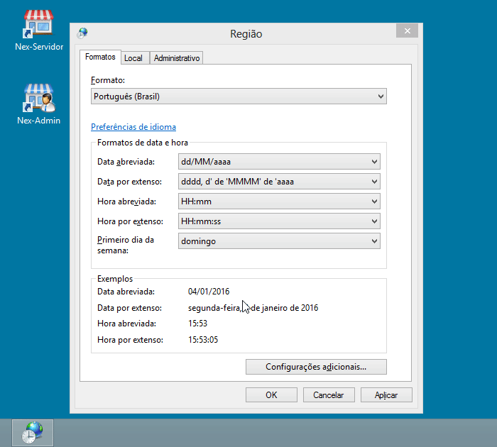

 

# Tabela de Campo
Tabela desenvolvida no Microsoft Excel para facilitar o armazenamento e processamento de dados geológicos de campo. Dados descritivos dos afloramentos, como características geográficas, localização, litologias, amostras coletadas, estruturas e recursos minerais, podem ser 
inseridos na tabela. 

A tabela foi desenvolvida com base no aplicativo AFLORA&#169;, API desenvolvido em Access pelo [Serviço Geológico do Brasil – SGB/CPRM](http://www.cprm.gov.br) utilizado para inserir dados de mapeamento geológico no [GeoSGB](http://geosgb.cprm.gov.br/) (banco de dados da empresa). A tabela  permite a exportação dos dados preenchidos para o aplicativo AFLORA&#169; de forma automatizada. 

## Download

#### Ultima Atualização: 20/06/2018

Para baixar a **Tabela de Campo** clique [aqui](https://github.com/Eliasmgprado/Tabela_de_Campo/archive/master.zip)

## Primeiros Passos

Antes de utilizar a tabela veja o [tutorial](https://github.com/Eliasmgprado/Tabela_de_Campo/raw/master/Guia_Tabela_de_Campo.pdf) para aprender a configurar e utilizar a tabela 

### Configurando Região

Algumas funções podem apresentar problemas caso o sistema operacional não esteja configurado no padrão americano de numeração (isto é, **ponto separador decimal e virgula separador de milhar**)

A alteração pode ser feita através do painel de controle. A localização da opção pode variar, em função da versão do Windows. Em nosso exemplo, estamos ilustrando o passo-a-passo para o Windows 7. Para fazer a alteração siga os seguintes passos: 

* Acesse o **Painel de controle**.
* Na opção **Relógio, idioma e região**, selecione a opção **Alterar idioma de exibição**.
* Clique na aba **formatos**. Em seguida, clique na opção **Configurações adicionais**.
* Clique na aba **Números**
* localize o campo *Símbolo decimal* (altere de vírgula para ponto).
* localize o campo *Símbolo de agrupamento de dígitos* (altere de ponto para vírgula).
* Clique em **Aplicar** e **Ok**.

### DICAS IMPORTANTES

* Caso as células de formula não estejam calculando, pressione **F9** pra forçar o calculo da aba.

* Para abrir o site do GoogleMaps com um ponto da Tabela de Campo plotado, selecione uma célula do ponto e pressione **Ctrl + Shift+ G**.

### Atualizar Tabela
Para atualizar uma tabela já preenchida para uma versão mais recente, siga os seguintes passos:
 * Abra a tabela em branco de versão mais recente
 * Vá a aba **Propriedades** e clique em **Importar Tabela de Campo**, 
 * Selecione o arquivo *.xlsm* da tabela de versão anterior, já preenchida.

## Autor

* **Elias Martins Guerra Prado** - [*Github* - Eliasmgprado](https://github.com/Eliasmgprado)
* **Guilherme Iolino Troncon Guerra**

## Colaboradores
* Equipe do [Serviço Geológico do Brasil – SGB/CPRM](http://www.cprm.gov.br), Divisão de Geologia e Recursos Minerais (DGM), Residência de Porto Velho (REPO), Rondônia (2015)

